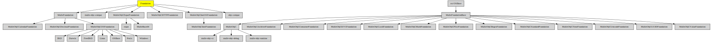

# Foundation

#### 💍 MulleFoundation with improved compatibility and legacy support

It's main raison d´etre is to support `#import <Foundation/Foundation.h>`
statements in Objective-C code.

It also adds the following libraries to the list of dependencies:


Library                                                                            | Description
-----------------------------------------------------------------------------------|---------------------
[MulleObjCExpatFoundation](//github.com/MulleFoundation/MulleObjCExpatFoundation)  | XML property lists
[MulleObjCJSMNFoundation](//github.com/MulleWeb/MulleObjCJSMNFoundation)           | JSON property lists
[MulleObjCHTTPFoundation](//github.com/MulleWeb/MulleObjCHTTPFoundation)           | NSURL handling
[objc-compat](//github.com/MulleFoundation/objc-compat)                            | Objective-C runtime glue
[mulle-objc-compat](//github.com/mulle-objc/mulle-objc-compat)                     | Apple runtime compatibility


### You are here




####  Legacy technologies

* File handling with NSURL


## Install

See [foundation-developer](//github.com/MulleFoundation/foundation-developer)
for instructions how to install via *apt* or *brew* or via an
installer script. There is also a "Dockerfile" available. It will install
everything you need.

### Legacy install

This builds everything and installs header and libraries into a folder of
your choice like `/usr/local` or `${HOME}`:

``` bash
mulle-sde install --prefix "/usr/local" \
                   "https://github.com/MulleFoundation/Foundation/archive/latest.tar.gz"
```


## Author

[Nat!](//www.mulle-kybernetik.com/weblog) for
[Mulle kybernetiK](//www.mulle-kybernetik.com) and
[Codeon GmbH](//www.codeon.de)
